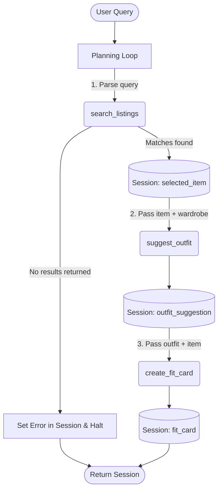

# FitFindr — planning.md

> Complete this document before writing any implementation code.
> Your spec and agent diagram are what you'll use to direct AI tools (Claude, Copilot, etc.) to generate your implementation — the more specific they are, the more useful the generated code will be.
> Your planning.md will be reviewed as part of your submission.
> Update it before starting any stretch features.

---

## Tools

List every tool your agent will use. For each tool, fill in all four fields.
You must have at least 3 tools. The three required tools are listed — add any additional tools below them.

### Tool 1: search_listings

**What it does:**

<!-- Describe what this tool does in 1–2 sentences -->

Searches the mock database for secondhand clothing items that match a user's text description, an optional size, and an optional maximum price.

**Input parameters:**

<!-- List each parameter, its type, and what it represents -->

- `description` (str): Keywords describing what the user is looking for (e.g., "vintage graphic tee").
- `size` (str): Optional size string to filter by (case-insensitive).
- `max_price` (float): Optional maximum price ceiling for the item.

**What it returns:**

<!-- Describe the return value — what fields does a result contain? -->

A list of dictionary objects representing the matching listings, sorted by relevance. Each listing contains fields like `id`, `title`, `description`, `price`, `size`, `platform`, etc.

**What happens if it fails or returns nothing:**

<!-- What should the agent do if no listings match? -->

It returns an empty list `[]`. The agent will detect this empty list, halt the workflow (skip Tool 2 and Tool 3), and return a polite error message advising the user to try different search terms.

---

### Tool 2: suggest_outfit

**What it does:**

<!-- Describe what this tool does in 1–2 sentences -->

Uses an LLM to generate 1–2 complete outfit suggestions by combining the newly found thrifted item with pieces from the user's existing wardrobe.

**Input parameters:**

<!-- List each parameter, its type, and what it represents -->

- `new_item` (dict): The listing dictionary of the item selected from the search results.
- `wardrobe` (dict): A dictionary containing an 'items' key with a list of the user's existing clothing pieces.

**What it returns:**

<!-- Describe the return value -->

A non-empty string containing personalized styling advice and outfit combinations.

**What happens if it fails or returns nothing:**

<!-- What should the agent do if the wardrobe is empty or no outfit can be suggested? -->

If the user's wardrobe is empty, it handles it gracefully by providing general styling advice for the new item instead of failing.

---

### Tool 3: create_fit_card

**What it does:**

<!-- Describe what this tool does in 1–2 sentences -->

Generates a short, trendy, and shareable social media caption (like for Instagram or TikTok) highlighting the new thrifted find and the suggested outfit.

**Input parameters:**

<!-- List each parameter, its type, and what it represents -->

- `outfit` (str): The styling suggestion string returned by the `suggest_outfit` tool.
- `new_item` (dict): The listing dictionary of the newly found thrifted item.

**What it returns:**

<!-- Describe the return value -->

A 2–4 sentence string representing the casual, authentic social media caption.

**What happens if it fails or returns nothing:**

<!-- What should the agent do if the outfit data is incomplete? -->

If the `outfit` string is missing or empty, it returns a descriptive error message string rather than raising an exception.

---

### Additional Tools (if any)

<!-- Copy the block above for any tools beyond the required three -->

---

## Planning Loop

**How does your agent decide which tool to call next?**

The agent runs a sequential, conditional workflow. It begins by extracting search parameters from the query and calling `search_listings`. It then evaluates the return value: if the returned list is empty, it halts the sequence immediately and returns an error state to the user. If items are found, it proceeds to call `suggest_outfit`. Once an outfit string is successfully generated, it triggers `create_fit_card`. It knows it is done when either all three tools have been called successfully, or an early exit condition (like no search results) is met.

---

## State Management

**How does information from one tool get passed to the next?**

The agent maintains a central `session` dictionary for each user interaction. It tracks `parsed_query`, `search_results`, `selected_item`, `outfit_suggestion`, `fit_card`, and any `error` message. When one tool finishes, its output is saved into the corresponding key in the session dict. The next tool then reads its required parameters from this shared session state (e.g., `suggest_outfit` takes the `selected_item` saved from the search step), ensuring a continuous flow without requiring the user to re-enter information.

---

## Error Handling

For each tool, describe the specific failure mode you're handling and what the agent does in response.

| Tool            | Failure mode                          | Agent response                                                |
| --------------- | ------------------------------------- | ------------------------------------------------------------- |
| search_listings | No results match the query            | Set an error in the session state and halt early.             |
| suggest_outfit  | Wardrobe is empty                     | Generate general styling advice instead of specific pairings. |
| create_fit_card | Outfit input is missing or incomplete | Return a descriptive error message string.                    |

---

## Architecture

---

## AI Tool Plan

**Milestone 3 — Individual tool implementations:**
I will use Gemini Code Assist. I will provide it with the "Tools" and "Error Handling" sections from this `planning.md`, along with the `listings.json` schema. I expect it to generate Python functions with proper typing, list filtering logic, and `try/except` blocks for the Groq API calls. Before moving on, I will verify the output by running a quick Python script that calls each tool in isolation (e.g., passing an empty wardrobe to ensure it doesn't crash).

**Milestone 4 — Planning loop and state management:**
I will use Gemini Code Assist. I will feed it the "Planning Loop", "State Management", and the Mermaid "Architecture" diagram from this document. I expect it to implement the `run_agent()` function in `agent.py`, complete with Regex parsing for the parameters, tool sequencing, state saving to the `session` dictionary, and the early-halt logic. I will verify it by running the `agent.py` CLI tests to confirm both the happy path and the no-results path work exactly as modeled in the diagram.

---

## A Complete Interaction (Step by Step)

Write out what a full user interaction looks like from start to finish — tool call by tool call. Use a specific example query.

**Example user query:** "I'm looking for a vintage graphic tee under $30. I mostly wear baggy jeans and chunky sneakers. What's out there and how would I style it?"

**Step 1:**
The agent parses the user query to extract the item description ("vintage graphic tee") and constraints (max_price=30.0). It then calls `search_listings(description="vintage graphic tee", max_price=30.0)` to find the best matching secondhand items from the database. It selects the top result. If no results are found, it sets an error message and stops here.

**Step 2:**
Using the top listing returned from Step 1 and the user's current wardrobe data, the agent calls `suggest_outfit(new_item, wardrobe)`. The LLM generates a personalized styling suggestion incorporating the new item and the user's baggy jeans/chunky sneakers.

**Step 3:**
The agent takes the new item and the generated outfit suggestion and passes them to `create_fit_card(outfit, new_item)`. The LLM crafts a short, trendy social media caption highlighting the thrifted find and how it was styled.

**Final output to user:**
The user sees the top listing details (Item title, price, platform, and condition), the generated outfit styling advice, and the final social media fit card caption. If the search failed at Step 1, the user simply sees a polite message suggesting they modify their search criteria.
